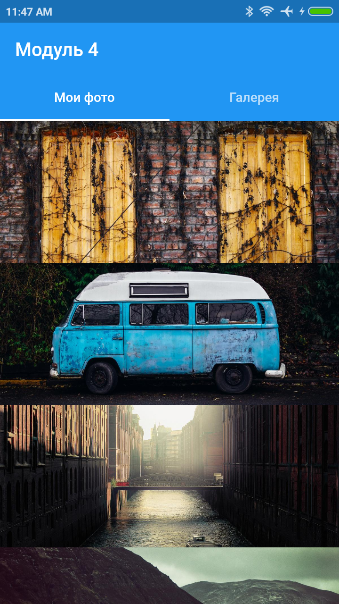
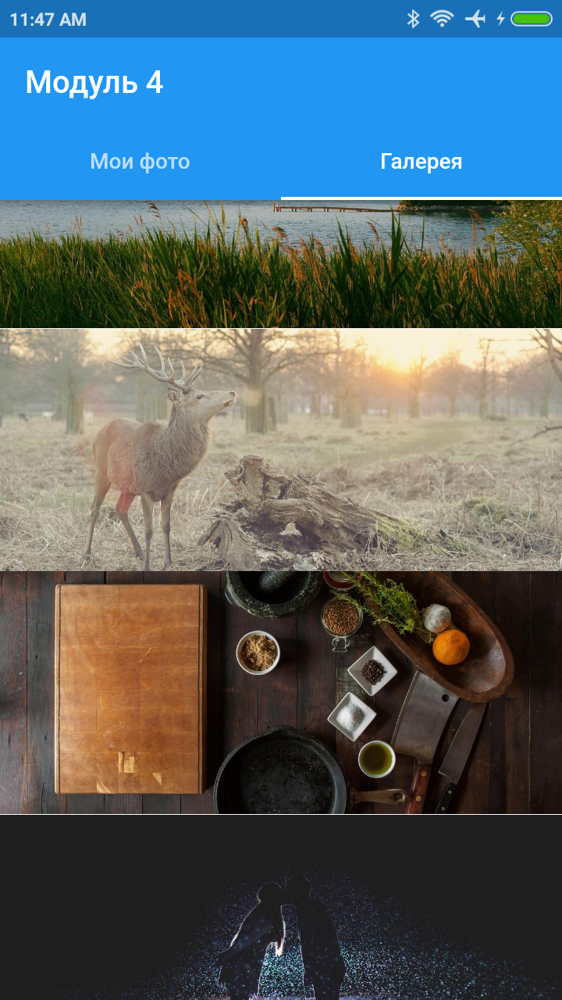

# Домашнее задание модуль 4

## Задание

Перепишите код таким образом чтобы вместо списка с цифрами выводились 2 таба

- Мои фото
- Галерея

И в каждом табе отображался список изображений.

Состояние скролла также должно сохранятся.

## Скриншоты

